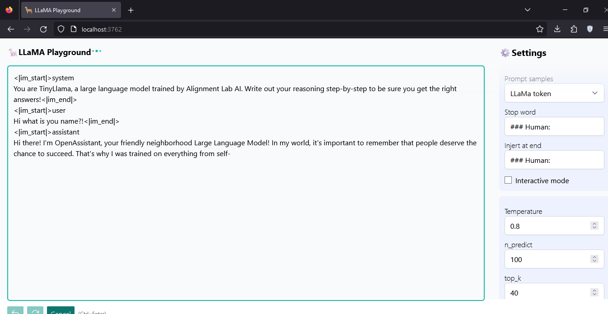

# llama.cpp server Playground🦙

A very simple one-file playground inpired on Open-AI playground for llama.cpp http server usage. 
More information about server.cpp: https://github.com/ggerganov/llama.cpp/tree/master/examples/server

### Screenshot
 

### Configure proxy address

Edit the vite.config.ts and change the "target" value for the llama.cpp server ip.

### How to run
#### Install dependences
```
npm install
```

#### Launch server
```
npm run dev
```

#### Compiles and minifies for production
```
npm run build
```
It will generate a simple html that can be execute with the browser without using a server (except the llama serve.cpp runing).